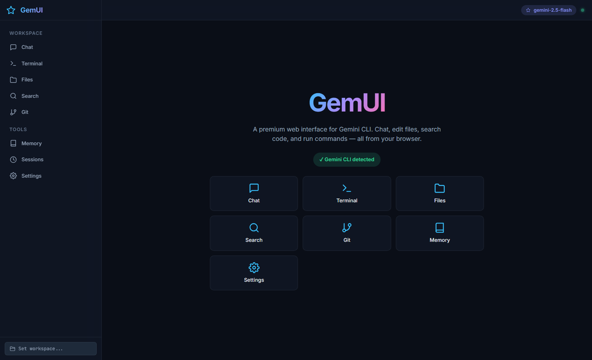

# GemUI

GemUI is a local web UI for the Gemini CLI.  
It gives you a Gemini-web-style interface while keeping CLI power features like workspace file access, terminal control, sessions, and memory editing.

## Screenshot



## Features

- Chat UI backed by a persistent Gemini CLI ACP session
- Chat attachments (files + images)
- Live context usage in chat when Gemini runtime emits usage telemetry (with an explicit ACP-unavailable indicator when not emitted)
- Integrated terminal panel
- Workspace file explorer + editor (Monaco)
- Code/text search (`grep`) and file glob search
- Gemini session history viewer (`~/.gemini/tmp`)
- `GEMINI.md` memory editor
- Model and behavior settings (`--yolo`, model selection)

## Tech Stack

- Frontend: React + Vite
- Backend: Node.js + Express + WebSocket
- Terminal: `xterm.js` + `node-pty` (with Windows fallback mode when needed)

## Prerequisites

- Node.js (LTS recommended)
- Gemini CLI installed and authenticated (`gemini` command available)

## Quick Start

```powershell
npm run install:all
npm run dev
```

Open: `http://localhost:5173`

## Production Run

```powershell
npm run build
npm start
```

Open: `http://127.0.0.1:4008`

## Important Scripts

- `npm run dev`  
  Starts server + client and automatically clears stale dev processes first.
- `npm run dev:stop`  
  Stops stale listeners/processes on dev ports (`4008`, `5173`).
- `npm run build`  
  Builds client assets.
- `npm start`  
  Runs Express server and serves built client.

## Project Structure

```text
client/   # React app (panels, UI, hooks, styles)
server/   # Express APIs, websocket handlers, session/workspace logic
scripts/  # Local dev helper scripts
```

## Notes on Runtime Behavior

- Chat runs on a persistent ACP runtime for lower latency.
- If ACP is unavailable, GemUI falls back to one-shot `stream-json` calls automatically.
- If a selected model is unavailable (`ModelNotFoundError`), GemUI retries with CLI default model automatically.
- On some Windows/Node combinations where `node-pty` is unstable, terminal falls back to a safe pipe mode to keep the app usable.
- Attachment limits: max 8 attachments per prompt, max 8 MB each.

## Troubleshooting

### `Failed running 'server.js'. Waiting for file changes before restarting...`

Usually stale processes are holding dev ports. Run:

```powershell
npm run dev:stop
npm run dev
```

### Chat returns model errors (`ModelNotFoundError`)

Use **Settings -> Active Model -> CLI Default (Recommended)**.  
Model availability depends on your Gemini account/project.

### Context usage meter is missing in Chat

GemUI Chat uses Gemini CLI ACP mode. In some Gemini CLI builds, ACP does not emit `usage_update`, so no context meter is available for Chat.

To ensure context is visible in the CLI footer:

1. Open the **Terminal** panel.
2. Run `/settings`.
3. Disable **Hide Context Window Percentage** (and keep **Hide Model Info** off).

Docs:
- Gemini CLI settings reference: https://geminicli.com/docs/reference/settings
- ACP usage updates are still unstable/draft: https://agentclientprotocol.com/protocol/specification-2026-01-14/draft/schema/UsageUpdate

### App shows disconnected websocket

- Confirm server is up on `127.0.0.1:4008`
- Restart with:

```powershell
npm run dev:stop
npm run dev
```

## Security/Scope Notes

- File APIs are constrained to the selected workspace root.
- Blocked files (like `.env`) are protected by server-side checks.
